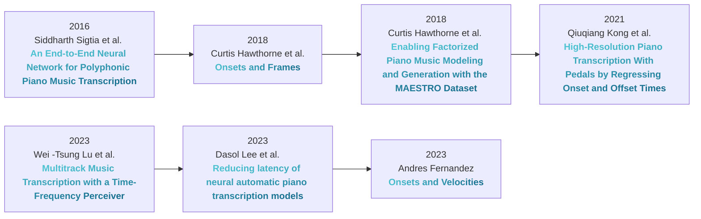
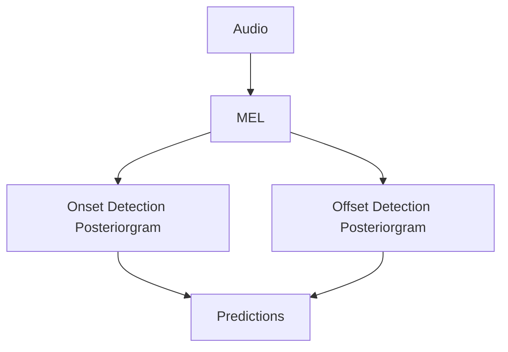
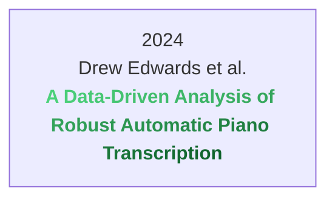
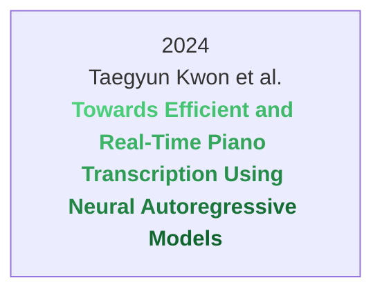

# Realtime piano transcription {.title}

 
A tool for music students, teachers and everyone who loves music.

  

---
transition: fade-out
---

# Problem: Why

<v-clicks>

- Pandemic: learning online
- Growing intreset in AI
- Apply to XR

</v-clicks>

<!--
- [click] The <a href="https://www.researchgate.net/publication/366228990_The_Impact_of_Covid-19_Pandemic_on_Music_Education_A_Review_of_the_Literature">pandemic</a> lead everyone to start learning new skills online.
- [click] Tools like chatgpt have sparked interest in AI.
- [click] The music industry is starting to <a href="https://www.alliedmarketresearch.com/augmented-and-virtual-reality-market">adopt</a> XR.
-->

---
transition: slide-up
---

# Problem: What

<v-clicks>

- Realtime piano transcription
- Low latency
- High accuracy
</v-clicks>
<!-- 
Una herramienta que permite transcripcion de piano en tiempo real[click], con baja latencia[click] y alta precision[click].
-->

---
layout: two-cols
layoutClass: gap-16
---

# TOC

Here is a table of contents:

::right::

<Toc v-click minDepth="1" maxDepth="2"></Toc>

---

# A Brief history on piano transcription

 

Velocity is important

<!--

- 2016: First End-to-end NN solution
- 2018: Onsets and Frames!
- 2018: MAESTRO dataset
- 2021: High resolution
- 2023: Multitrack: Multiple instruments
- 2023: Latency
- 2023: Velocities

-->

---
layout: two-cols
layoutClass: gap-16
---

# A Brief history on piano transcription \[2\]

<a href="https://goo.gl/magenta/onsets-frames-examples">Onsets And Frames</a>

::right::

<!--

- Audio
- MEL
- Onset & Offset Detection
- Predictions (Decoding)

-->

---

# Problem: To who

<v-clicks>

- Music students (All levels)
- Music teachers
- Music schools
- Composers
- Developers (B2B)
</v-clicks>

<v-click>

## Other markets:

- <v-click>Gaming</v-click>

<v-click>
<Youtube id="jyR1W3X9s74?start=205&end=213&mute=1&loop=1&autoplay=1&controls=0&playlist=jyR1W3X9s74" />
</v-click>

</v-click>

<!--
Le vamos a vender a
- [click] practicar, y aprender piano;
  - 1.7% <a href="https://www.music.org/pdf/mihe/facts.pdf">toman musica como carrera</a>
  - 70% <a href="https://admissionsly.com/wp-content/uploads/2020/05/3-1.png">hacen una carrera</a>
  - 90% <a href="https://en.wikipedia.org/wiki/Educational_attainment_in_the_United_States#:~:text=In%202018%2C%20nearly%209/10,in%201950%20versus%2090%25%20today.">terminan la secundaria</a>
  - Osea: 1.7% * 70% * 90% = 1.07% de la poblacion
  - La <a href="https://www.worldometers.info/">poblacion</a> es ~8.186.830.000
  - Osea: ~87.680.949 estudiantes de musica
  - 15% <a href="https://www.researchgate.net/figure/Distribution-of-the-musical-instruments-played-by-the-participants_fig1_260796060">estudia piano</a>
  - 0.15% del mercado: 13.152.142 estudiantes de piano
- [click] dar clases
  - <a href="https://www.zippia.com/music-teacher-jobs/demographics/">30 150</a> profesores de musica
  - <a href="https://www.dpeaflcio.org/factsheets/the-professional-and-technical-workforce-by-the-numbers">93 000 000 profesionales</a>
  - <a href="https://www.dpeaflcio.org/factsheets/the-professional-and-technical-workforce-by-the-numbers">57.8% de la fuerza laboral son profesionales</a>
  - Osea: 3.2% de los profesionales son profesores de musica; 1.8% de la fuerza laboral
  - 3500000000 * 0.018 = 63.000.000 profesores de musica
- [click] clases online, en tiempo real, telepresencia.
- [click] transcribir, rapidamente, no preocuparse por la transcripcion.
- [click] Implementar su propia aplicacion sobre nuestra API

Otras oportunidades:
- [click] Juegos
-->

---
layout: image-right
image: /images/piano-vr.webp
---

# Opportunities

<v-click>

- <a href="https://market.us/report/music-streaming-market/">Growing music market</a> 

</v-click>
 
 
 
 
 
<v-clicks>

- Experienced dev team
- Could partner with music schools
- Music education is not a niche market
</v-clicks>

# Threats {.red}
<v-clicks depth=2>

- Competition: Speed to market
  - No other VR app does transcription at the moment
- Tech limitations

</v-clicks>

<!-- 

- Growing music market [click] 
- [click] Experienced dev team; Could expand to not only music education, but also music production, gaming, etc.
- [click] By licensing the software to music schools, we could reach a larger audience and have a more stable income.
- [click] Music education is not a niche market: 1.7% of the population studies music, 15% of them study piano.

Threats
- [click] With the AI boom, competition is fierce. Speed to market is crucial.
  - [click] Unique for now
- [click] Tech limitations: Latency, accuracy, etc. But also compute.
-->

---
layout: image-left
image: /images/piano-vr2.jpg
---

# Weaknesses {.red}
<v-clicks>

- High development costs
- Complex user onboarding
</v-clicks>

# Strengths

<v-click>
Unique product
</v-click>

- <v-click> <strong class="green">Physical instrument support</strong> </v-click>

- <v-click> Realtime transcription </v-click> <v-click> & Low latency </v-click> <v-click> = <strong class="blue">Realtime Feedback</strong> </v-click>

<!--

Weaknesses
- [click] The software is complex and requires a lot of development. **High model training cost**
- [click] If not done correctly, user onboarding could be a nightmare.
- [click] Unique product: There are no other products that offer realtime piano transcription.

Strength
- The best thing we have is [click] physical instrument support.

-->

---
layout: image
image: /images/use-cases.jpg
---

# Use cases

<v-click>

</v-click>

<v-click>

</v-click>

<!-- 
(Explain the use cases) How can we know we can get all 3?
- [click] Generalization
- [click] Realtime
-->

---
layout: two-cols
layoutClass: gap-16
---

# Problem: Via

<v-clicks>

- Web
- Oculus Quest
- Native PC App

</v-clicks>

::right::

  
   
   
  
  

<!-- 
How to give the product to the user.
- [click] Web: Easy to use, but limited by the browser.
- [click] Oculus Quest: High quality, but requires a headset.
- [click] Native PC App: High quality, but requires a computer.
-->

---

# Problem: $$?

<v-clicks>

- Individuals: One-time purchase
- Organizations: Licensing
- Developers: API access subscription

</v-clicks>

<!--

- [click] Individuals: One-time purchase
- [click] Organizations: Licensing
- [click] Could also offer a subscription model

-->

---

# Plans

<v-clicks depth=2>

- MVP
  - Train transcription model
  - Finish polishing AR app
  - Launch
- 1 year
  - Expand to other instruments
  - Improve transcription accuracy
  - Expand to other markets

</v-clicks>

<!--

- MVP
- 1 year plan

-->

---

# Infrastructure

<v-clicks>

- Require AR glasses
- Require a piano
- Require a computer

</v-clicks>

<!--
Infrastructure is a big part of the product.

We could consider partnering with VR companies to provide the glasses, or even provide them ourselves.
-->

---

# Problem: Costs

<v-clicks>

- Development
- Marketing
- Server + App Maintenance
- Hiring a team

</v-clicks>

<!-- 
- [click] Development: High cost; This includes model training, app development, etc.
- [click] Marketing: High cost
- [click] Server + App Maintenance: High cost
- [click] Could also consider hiring a team of developers, or outsourcing the work.

-->

---
layout: image
image: /images/piano.jpeg
---

# Thank you!

<GithubLink/>
<a href="https://soundcloud.com/mighty_helper/random-improvs-yama00">Music!</a>

---

# AR Demo

<SlidevVideo v-click autoplay='once' autoreset='click'>
  <source src="/images/piano-sync-gif.mp4" type="video/mp4"/>
</SlidevVideo>

---